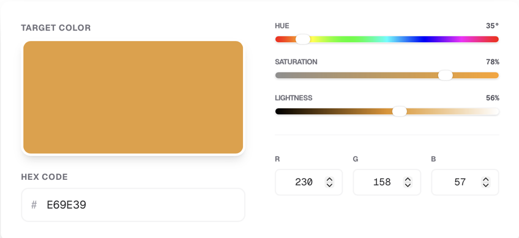

<H1>Filament RGBSearch</H1>

| ΔE | How the Eye Perceives the Difference |
|:----:|:----------------------------------:|
| < 1 | No visible difference |
| 1–2 | Barely perceptible |
| 2–5 | Small but noticeable difference |
| 5–10 | Clearly different, but still related |
| > 10 | Completely different color |

